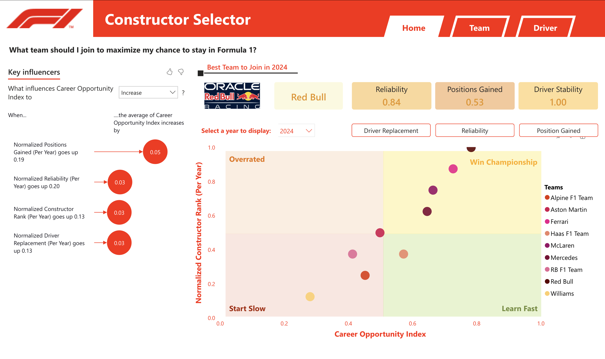
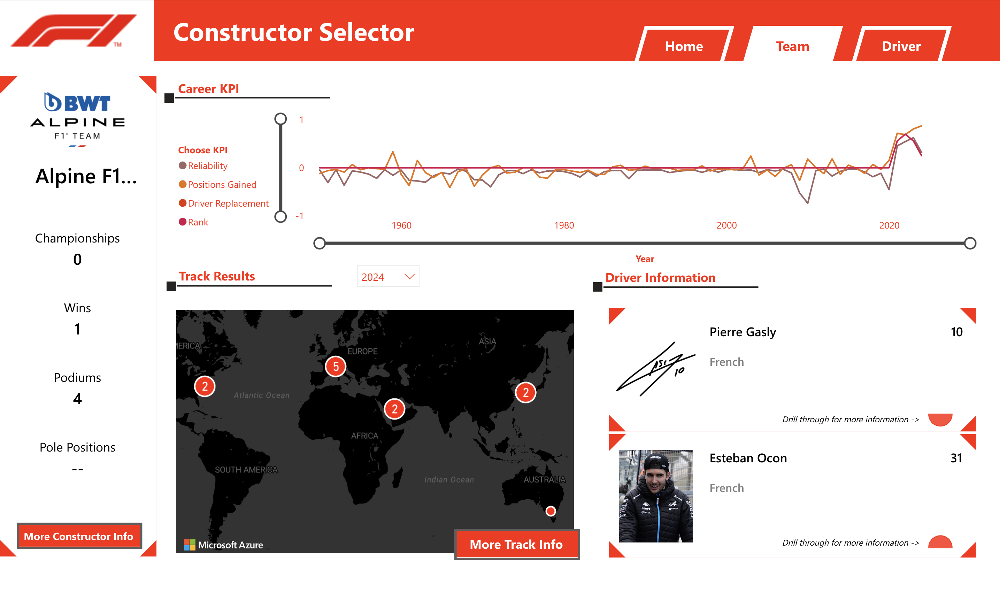
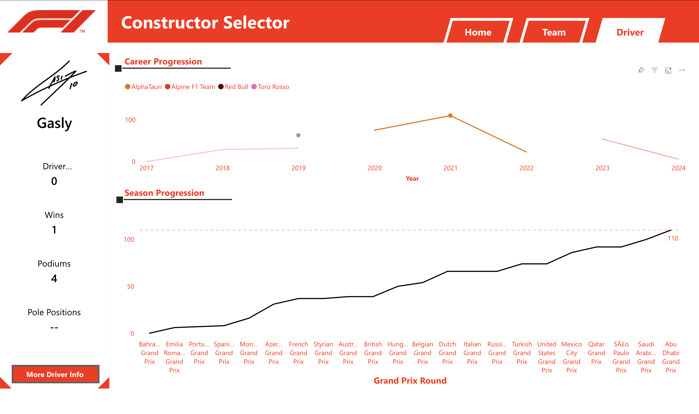

# F1 Constructor Selector

**Analyze Formula 1 team and driver performance to maximize career opportunities.**

---

## 📊 **Overview**
This repository contains a **Power BI dashboard** designed to help Formula 1 drivers and teams analyze performance metrics, career progression, and opportunities.

---

## 🖼 **Visuals and Analysis**

### 1. **Best Team to Join**

**Analysis:**
- **Best Team:** Highlights the best team to join for a given year based on reliability, positions gained, and driver stability.
- **Key Metrics:**
  - **Reliability:** Consistency of the team.
  - **Positions Gained:** Average positions gained per race.
  - **Driver Stability:** Stability of driver line-up.
- **Career Opportunity Index:** Graph compares teams based on:
  - **Career Opportunity Index** (x-axis)
  - **Normalized Constructor Rank** (y-axis)
- **Quadrants:**
  - **Win Championship** (top-right): Teams with high opportunity and high rank.
  - **Learn Fast** (bottom-right): Teams with high opportunity but lower rank.
  - **Start Slow** (bottom-left): Teams with lower opportunity and lower rank.
  - **Overrated** (top-left): Teams with lower opportunity but higher rank.

---

### 2. **Team View**

**Analysis:**
- **Team Performance:** Overview of key performance indicators (KPIs) for any selected team.
- **Key Metrics:**
  - **Championships:** Number of championships won by the team.
  - **Wins:** Total wins by the team.
  - **Podiums:** Total podiums achieved.
  - **Pole Positions:** Total pole positions secured.
- **Career KPIs:** Trends in reliability, positions gained, driver replacement, and rank over time.
- **Geographical Distribution:** Map showing the distribution of wins across different continents.
- **Drivers:** Information about the current drivers, including their nationality and performance rank.

---

### 3. **Driver Career Progression**

**Analysis:**
- **Career Progression:** Shows the progression of a driver's career across different teams.
- **Key Metrics:**
  - **Wins:** Total wins by the driver.
  - **Podiums:** Total podiums achieved by the driver.
  - **Pole Positions:** Total pole positions secured by the driver.
- **Season Progression:** Performance trends of the driver over different seasons.
- **Team Comparison:** Performance trends while driving for different teams.

---
